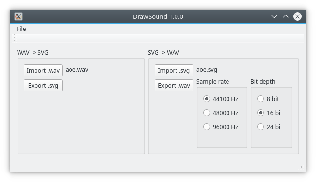
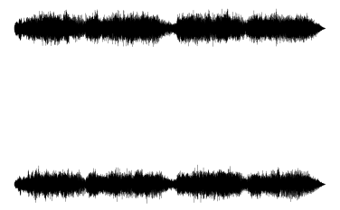

# WAV-SVG

WAV from/to SVG converter (back and forth)

<!-- Version and License Badges -->
 
 
 


This project has two programs:
  * wav-svg command line utility
  * DrawSound GUI tool

Both of them allow you to convert a WAV file into SVG and an SVG file into a WAV file.



The generated SVG file has one polyline element for each audio channel.




SVG audio format
-------

The SVG format representing an audio signal must be defined to have the same reference between the two ways of transformation. The SVG must 
contains a list of polyline elements. Each polyline is one audio channel.

```xml
<svg>
	<polyline points="..." />
	<polyline points="..." />
</svg>
```

A polyline element is a series of points linked togather with a line. Please refer to any SVG tutorial or documentation to learn more on this SVG element.

The SVG coordinate system varies according to the number of channel. The X-axis is always 1000 size. One channel uses a Y-axis of 500.


The WAV samples are always between [-1.0 +1.0] (min and max of a sinus) and are normalized between [0 500] during the transformation, for the first channel. 
All other channels are located under the previous one with a 500 Y-axis offset. There is theorically no limitations on the number of channels.

The X-axis step is generated to keep a constant space between samples. For WAV generation, the X-axis points are not used.

Acknowledgements
-------

Thanks to the Pyhon library wav2vec https://github.com/cristoper/wav2vec, my SVG file format is the same.

Third party libraries
-------

  * Qt (qt.io)
  * AudioFile is written and maintained by Adam Stark [http://www.adamstark.co.uk](http://www.adamstark.co.uk) Copyright (c) 2017 Adam Stark
  * Some functions borrowed from NanoSVG https://github.com/memononen/nanosvg (zlib license) Nano SVG Copyright (c) 2013-14 Mikko Mononen memon@inside.org

How to build
-------

Use Qt, each project has its own project (.pro) file. The command line program has its own Makefile project. Just type make to build it.

Versions
-------

##### 1.0.0 - 19th May 2018

- Version 1.0
- GUI
- Command line tool

##### 0.1.0-alpha - 8th May 2018

- Initial release (generation only, one channel)

TODO
-------

  * Support 32-bit audio generation
  * Add options to the command line program

License
-------

Copyright (c) 2018 Anthony Rabine

This program is free software: you can redistribute it and/or modify
it under the terms of the GNU General Public License as published by
the Free Software Foundation, either version 3 of the License, or
(at your option) any later version.

This program is distributed in the hope that it will be useful,
but WITHOUT ANY WARRANTY; without even the implied warranty of
MERCHANTABILITY or FITNESS FOR A PARTICULAR PURPOSE.  See the
GNU General Public License for more details.

You should have received a copy of the GNU General Public License
along with this program.  If not, see <http://www.gnu.org/licenses/>.
